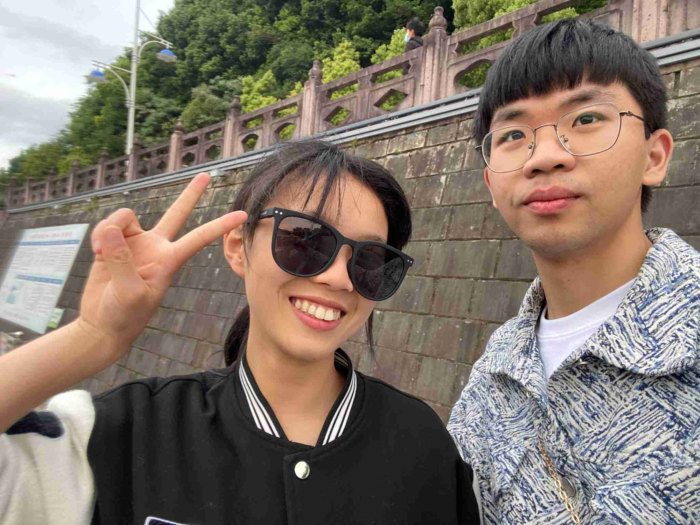
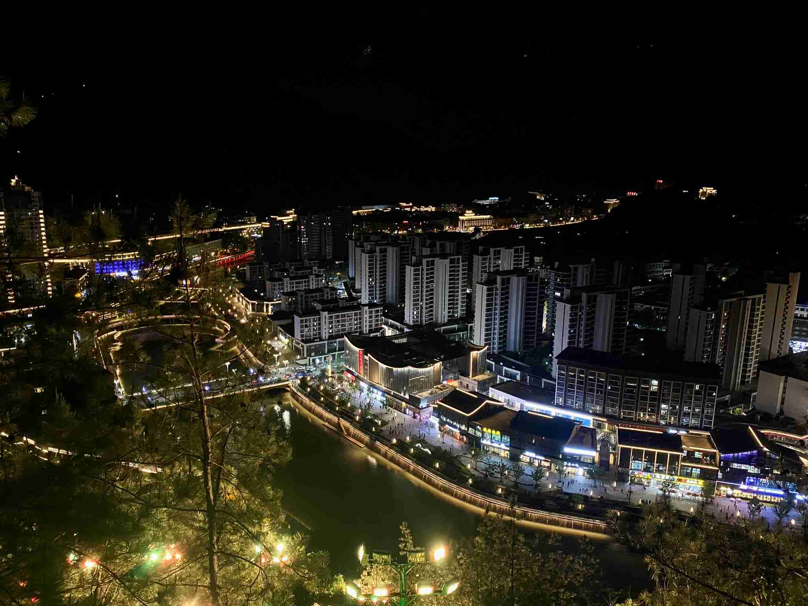
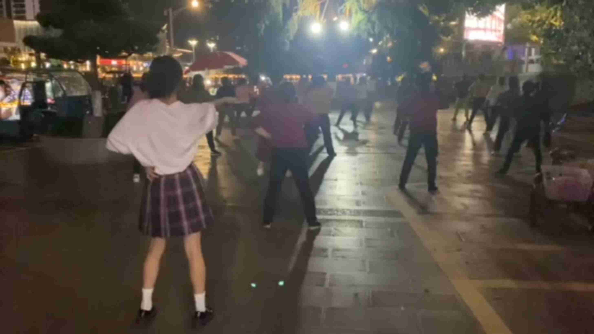
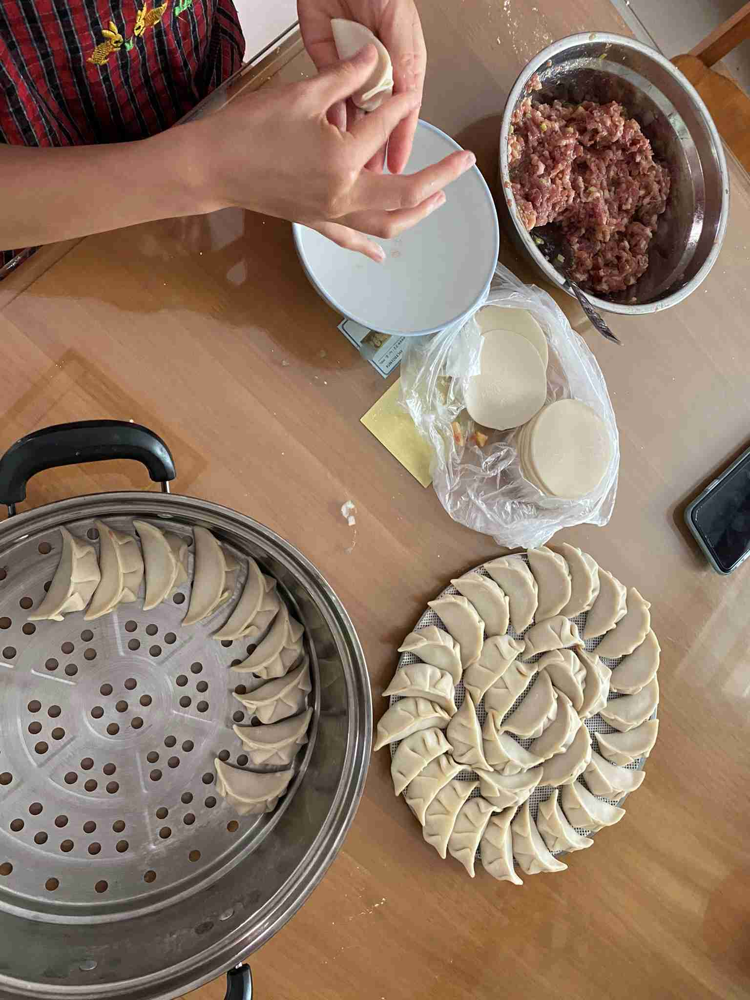
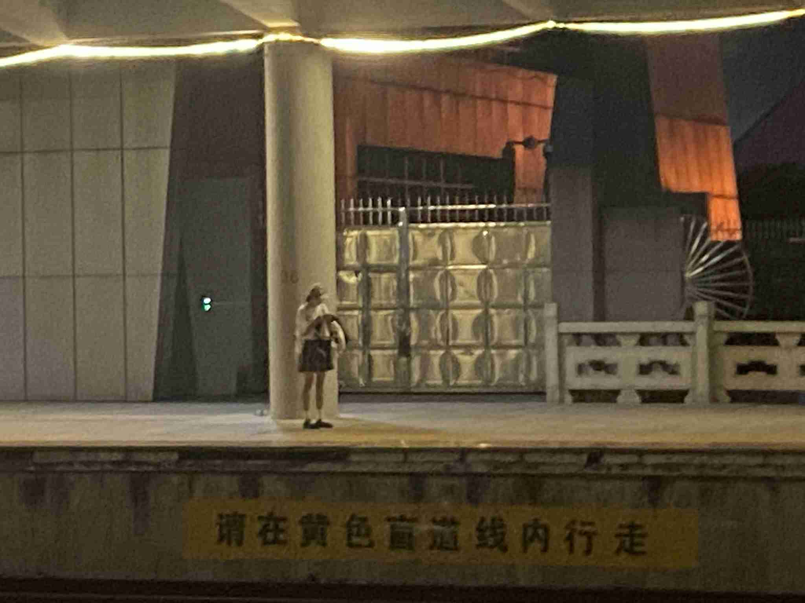
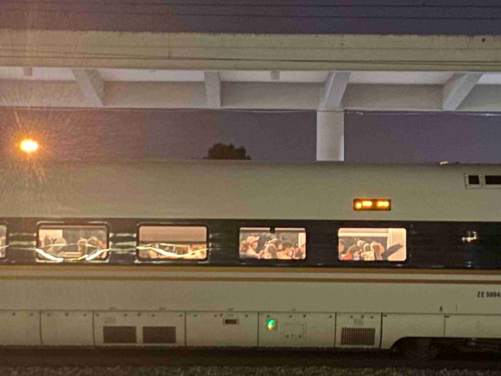

## ☀️ 奔赴山海

去磐安的路上，天气好得像开了滤镜，她的心情也跟着车窗外的风景一起飞扬起来。

终于见面啦！第一件事当然是——咔嚓一张，记录下这久违的合体时刻。

---

## 🌙 夜游磐安

晚上的磐安别有一番风味。和好友吃完东北菜后我们决定去爬海螺山，消食散步，顺便带她俯瞰一下这座小城的夜景。

最搞笑的插曲发生在盘龙广场。

看到大妈们跳得正嗨，她也按捺不住“舞魂”，混入其中跟着节奏跳了起来。别说，这动作还挺像模像样的，毫无违和感！😂

看音乐喷泉的时候，因为站得太近，水柱突然喷高时，她吓得拔腿就跑。照片都拍模糊了，但当时那种狼狈又好笑的快乐，现在想起来还在笑。

> **画外音**：快跑！要湿身了！

---

## 🥟 家的味道

假期的尾声，不是大鱼大肉，而吃一顿她亲手包的饺子。

---

## 🚄 离别

快乐的时间总是过得太快，又到了要分开的时候。

高铁站的每一次挥手，都是为了下一次更好的重逢。

